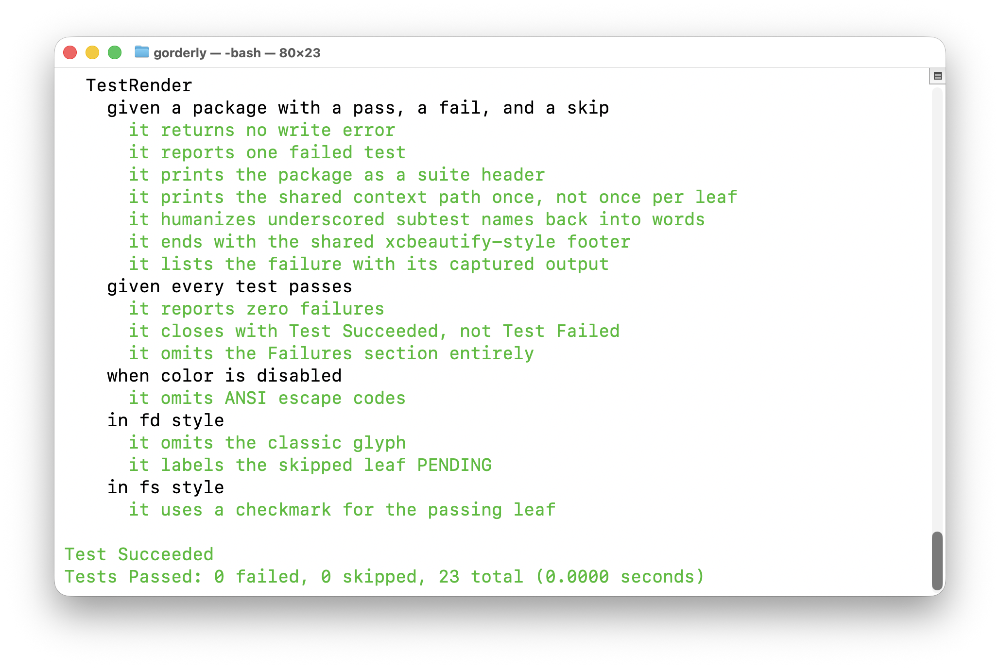

# gorderly

[](https://github.com/woodie/gorderly)
[](https://github.com/woodie/gorderly/actions/workflows/ci.yml)
[](https://github.com/woodie/gorderly/releases/latest)
[](LICENSE)



RSpec `-fd` style output for plain `go test` -- no BDD framework required.

`gorderly` reads `go test -v`'s raw output directly (the same textual
protocol every other Go tool already parses) and re-renders it as a nested
tree, using the hierarchy `t.Run` subtests already carry in their
`/`-joined names. No `--json-report` round trip, no test-runner dependency,
no third-party BDD DSL to adopt -- if your tests use stdlib `testing` with
nested `t.Run`, `gorderly` already understands them.

## Installation

```
go install github.com/woodie/gorderly@latest
```

Or build locally:

```
go build -o gorderly
mv gorderly ~/go/bin/
```

## Usage

Pipe `go test -v`'s output straight in:

```
go test -v ./... | gorderly -fd
```

Or let `gorderly` run `go test` for you:

```
gorderly -fd .
gorderly -fd ./...
```

Flags: default (no flag) renders the classic style (glyph + per-test
elapsed time); `-fd` renders RSpec's `-fd` documentation format; `-fs`
renders Mocha/Jest's spec format; `--format documentation` and `--format
spec` are the long forms of `-fd`/`-fs`, matching
[`xctidy`](https://github.com/woodie/xctidy)'s exact flag surface.

## Why not gotestsum?

[`gotestsum`](https://github.com/gotestyourself/gotestsum) is the
established, widely-adopted tool in this space, and already covers `dots`,
`testname`, `pkgname`, and `testdox` formats well -- reach for it first if
one of those is what you want. `gorderly` exists for the one format
`gotestsum` doesn't have: a real nested, indented tree that dedupes the
shared parent path between adjacent tests, the way RSpec's `-fd` and
`xctidy` both render `describe`/`context`/`it`.

## Known limitations

- Tree order follows the order results complete in, which matches
  declaration order for serial tests but can reorder under `t.Parallel()` --
  the same assumption Ginkgo's own native `-fd` flag makes (see
  [onsi/ginkgo#1670](https://github.com/onsi/ginkgo/pull/1670)).
- Subtest names have spaces substituted with underscores by `go test`
  itself; `gorderly` reverses that for display, which is imprecise for
  subtest names with genuine underscores in them.
- Package build failures are reported by outcome only, not with the
  underlying compiler error -- run `go vet`/`go build` separately to see why
  a package failed to build.

## Development

```
make test    # verbose, dogfoods gorderly on its own suite
make lint    # golangci-lint
make check   # terse: silent on success, full log on failure
```
